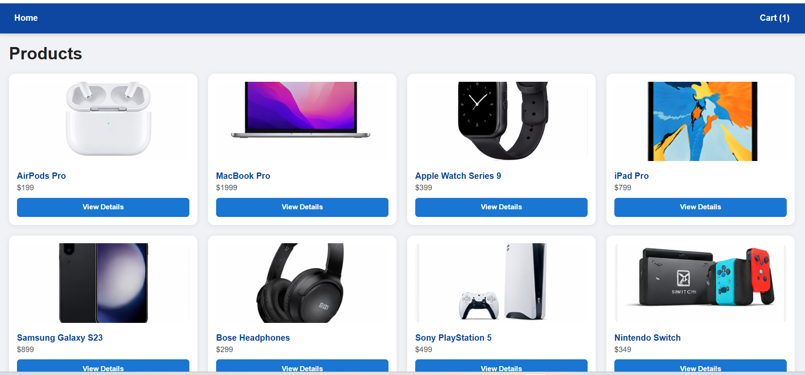
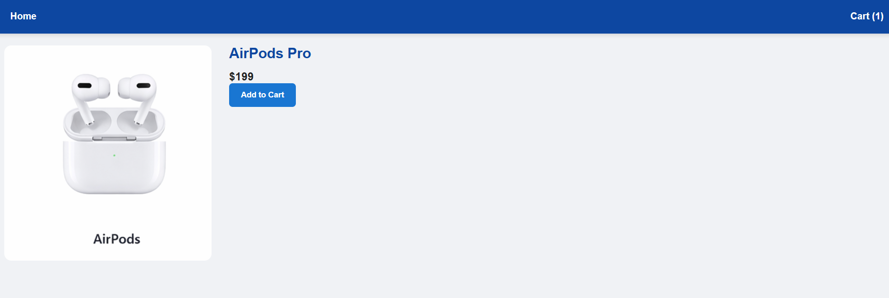
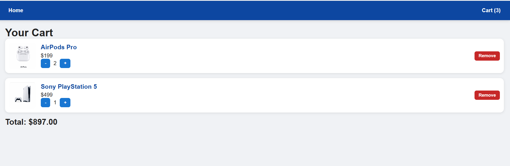

# E-commerce Frontend


💻 Live Demo: [click here](https://69bbdb0257b427b228ab5e08--boisterous-gumdrop-4d317b.netlify.app/)

---

A fully responsive E-commerce frontend built with **React, Vite, and CSS**, designed to match Figma mock pages.  
Users can browse products, view details, add items to cart, adjust quantities, and see total prices. Works seamlessly on **PC and mobile**.

---

## 🌟 Features

- Home page with responsive product grid  
- Product Detail page with image, description, price, and Add to Cart button  
- Cart page with add, subtract, remove items and total price calculation  
- Responsive navbar with cart item count  
- Fully mobile-friendly layout  
- Smooth hover and tap effects on cards and buttons  
- Error handling for product loading  

---

## 🛠 Tech Stack

- React 18  
- React Router DOM  
- Vite 8  
- CSS / Flexbox & Grid  
- JavaScript (ES6)  

---

## 📸 Screenshots

Home Page:  
  

Product Detail Page:  
  

Cart Page:  
  

---

## 🚀 Installation / Running Locally

Clone the repository:

```bash
git clone https://github.com/Javeria2003/Ecommerce-Frontend.git
cd Ecommerce-Frontend
## 👩‍💻 Author

**Javeria Aslahuddin**  
- GitHub: [@Javeria2003](https://github.com/Javeria2003)  
- Email: javeriajolly03@gmail.com  

## 📄 License

This project is for educational purposes / team submission.
